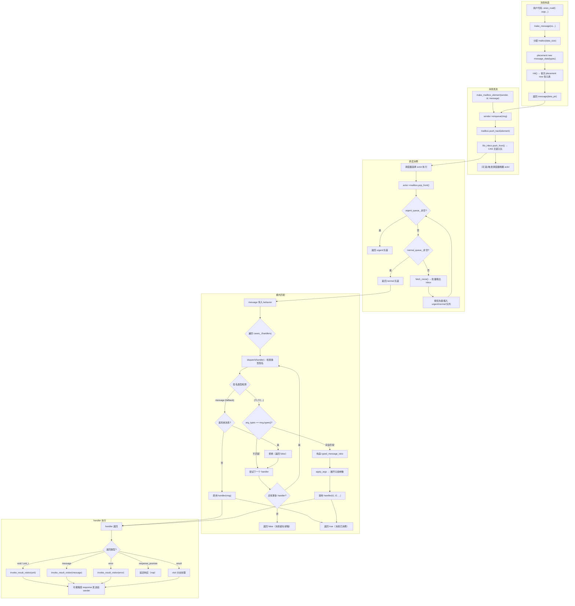
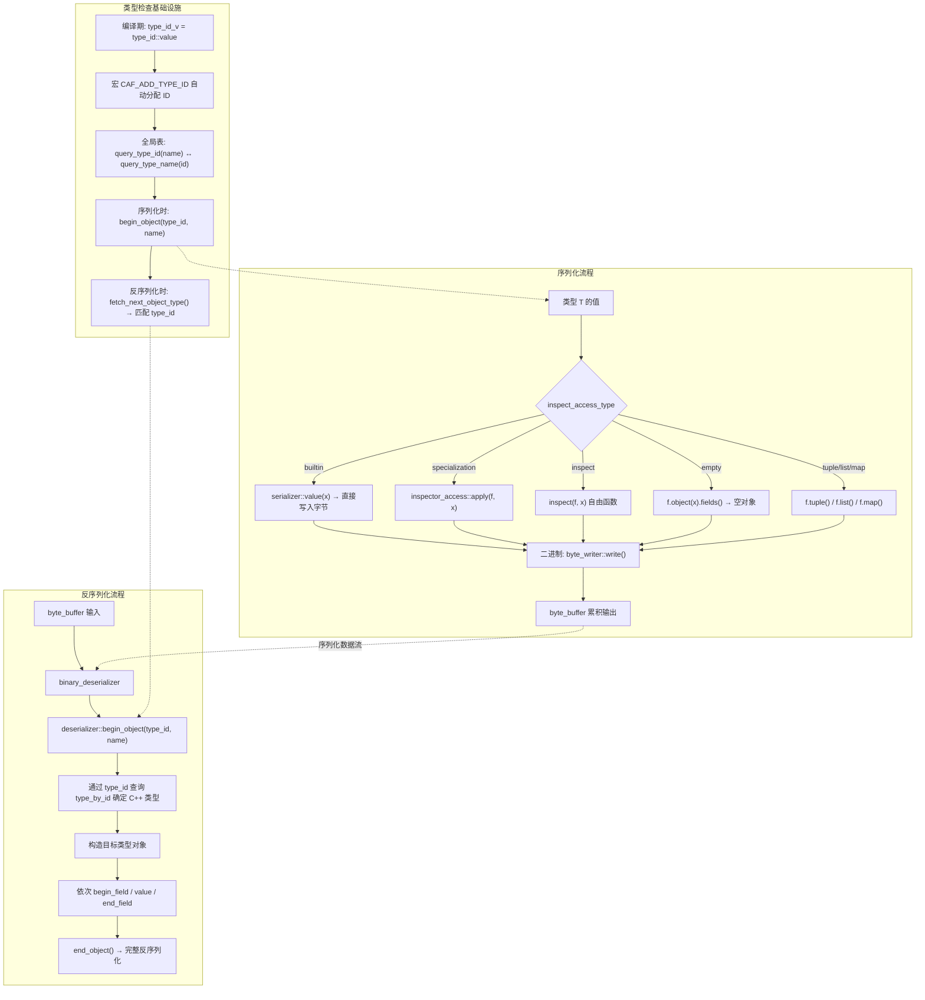
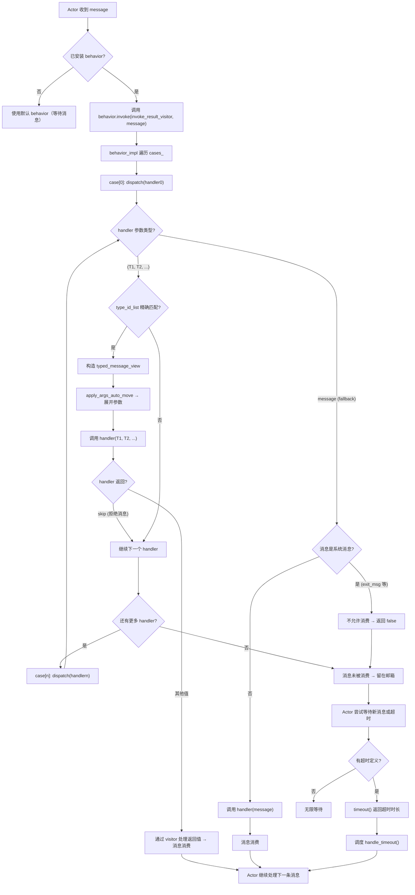

# Message Passing & Behavior 子系统深度分析

> 分析日期：2000-01-01
> 代码基版本：CAF (C++ Actor Framework), libcaf_core

---

## 1. 消息类型系统

CAF 的消息系统围绕一个核心设计理念：**类型擦除的元组，带编译期类型安全视图**。

### 1.1 `message` -- 类型擦除设计

`message` 类 (`libcaf_core/caf/message.hpp:32-219`) 是一个固定长度、写时复制的类型擦除元组。它持有 `intrusive_cow_ptr<detail::message_data>`，实现共享引用计数的惰性拷贝。

```
message
  |
  +-- data_ptr (intrusive_cow_ptr<message_data>)
        |
        +-- ref_count_ (atomic)
        +-- types_ (type_id_list)
        +-- constructed_elements_ (size_t)
        +-- storage_[] (std::byte[], flexible array member)
```

**关键设计点**：

- **类型擦除**：`message` 在运行时只存储 `type_id_list`（一个 `uint16_t` 的数组），不保留任何 C++ 类型信息。元素值以原始字节形式连续存储在 `storage_[]` 柔性数组中。

- **元素访问** (`message.hpp:157-168`)：
  ```cpp
  template <class T>
  const T& get_as(size_t index) const noexcept {
      CAF_ASSERT(type_at(index) == type_id_v<T>);
      return *reinterpret_cast<const T*>(data_->at(index));
  }
  ```
  访问时通过 `reinterpret_cast` 将原始字节强制转换为目标类型的引用。**无运行时类型检查**——由调用方保证 `match_element<T>(index)` 为真。

- **写时复制 (COW)**：通过 `intrusive_cow_ptr` 实现。`data()` 方法 (`message.hpp:86`) 调用 `data_.unshared()`，仅在引用计数 > 1 时触发深拷贝。

- **消息构造** (`message.hpp:229-244`)：
  ```cpp
  template <class... Ts>
  message make_message(Ts&&... xs) {
      auto types = make_type_id_list<strip_and_convert_t<Ts>...>();
      auto vptr = malloc(data_size);
      auto raw_ptr = new (vptr) message_data(types);
      raw_ptr->init(std::forward<Ts>(xs)...);
      return message{std::move(ptr)};
  }
  ```
  分配一块连续内存（`message_data` 头部 + 元素数据区），用 placement new 在 `storage_` 区域依次构造每个元素。每个元素按 `padded_size_v<T>` 对齐。

### 1.2 `message_data` -- 底层存储

文件 `libcaf_core/caf/detail/message_data.hpp:34-189`。

`message_data` 使用 C 风格柔性数组成员 (`storage_[]`) 存储元素数据。内存布局如下：

```
|-- message_data header --|-- elem0 (padded) --|-- elem1 (padded) --|-- ... --|
  ref_count_ (4 or 8 bytes)
  types_ (type_id_list, 8 bytes)
  constructed_elements_ (8 bytes)
  storage_[] (flexible array)
```

- `init()` 方法 (`message_data.hpp:113-115`)：对每个元素调用 placement new。
- 析构时遍历 `types_` 列表，依次调用元素的析构函数（通过 type_id 派发）。

`type_id_list` (`libcaf_core/caf/type_id_list.hpp:21-97`) 是一个底层指针包装，指向一个**大小前缀的连续 `uint16_t` 数组**：

```
data_ -> | size (uint16_t) | type_id_1 | type_id_2 | ... |
```

`data_[0]` 存储元素个数，`data_[1..n]` 存储每个元素的 `type_id_t`。

### 1.3 `type_id` 全局唯一类型标识

文件 `libcaf_core/caf/type_id.hpp:26-551`。

`type_id_t` 定义为 `uint16_t`，`invalid_type_id = 65535`。

核心机制：
```cpp
template <class T>
struct type_id;  // 主模板，未定义

template <class T>
constexpr type_id_t type_id_v = type_id<detail::squash_if_int_t<T>>::value;
```

- 每个类型通过宏 `CAF_ADD_TYPE_ID` 在**编译期**获得全局唯一 ID。
- ID 值通过 `__COUNTER__` 预定义宏在翻译单元间顺序分配。
- 系统保留 `[0, first_custom_type_id)` （即 0-199）给 CAF 核心模块。
- `CAF_BEGIN_TYPE_ID_BLOCK` / `CAF_END_TYPE_ID_BLOCK` 定义 ID 区间。
- 配套的 `type_by_id<V>` 和 `type_name_by_id<V>` 实现**双向映射**（type -> name, id -> type）。

**运行时类型匹配**全路径：
1. `message.types()` 返回 `type_id_list`
2. `behavior_impl::invoke()` 中 `to_type_id_list<decayed_args>()` 对 handler 的函数参数类型编译期生成 `type_id_list`
3. 通过 `arg_types != msg.types()` 比较实现模式匹配

比较算法 (`type_id_list.hpp:59-68`)：
```cpp
int compare(type_id_list other) const noexcept {
    int s1 = data_[0];
    int s2 = other.data_[0];
    int diff = s1 - s2;
    if (diff == 0)
        return memcmp(begin(), other.begin(),
                      s1 * sizeof(type_id_t));
    return diff;
}
```
先比较长度，再 `memcmp` 整个 ID 数组——**O(n) 精确匹配**。

### 1.4 强类型视图：`typed_message_view` 与 `const_typed_message_view`

文件 `libcaf_core/caf/typed_message_view.hpp:14-57` 和 `libcaf_core/caf/const_typed_message_view.hpp:17-79`。

**功能**：在类型擦除的 `message` 之上，通过模板参数 `Ts...` 提供编译期强类型访问。

```cpp
template <class... Ts>
class typed_message_view {
    explicit typed_message_view(message& msg)
      : ptr_(msg.types() == make_type_id_list<Ts...>() ? msg.ptr() : nullptr) {
        // 运行时验证：类型列表完全匹配才构造成功
    }
};
```

**关键点**：
- 构造时自动进行运行时类型校验——**校验失败返回空视图**（`ptr_ == nullptr`）。
- 元素通过 `get<Index>(view)` 访问，使用 `offset_at<Index, Ts...>` 编译期计算偏移量：
  ```cpp
  template <size_t Index, class... Ts>
  auto& get(typed_message_view<Ts...> x) {
      using type = caf::detail::tl_at_t<caf::type_list<Ts...>, Index>;
      return *reinterpret_cast<type*>(x->storage() + detail::offset_at<Index, Ts...>);
  }
  ```
- `is_const` 标志位：`typed_message_view` 为 `false`，`const_typed_message_view` 为 `true`，用于行为匹配时的参数传递优化（**突变 vs 只读**）。

---

## 2. 行为与模式匹配

### 2.1 `behavior` 与 `message_handler`

`message_handler` (`libcaf_core/caf/message_handler.hpp:27-112`) 是一个**部分函数实现**——可以接受或拒绝一条消息。

`behavior` (`libcaf_core/caf/behavior.hpp:25-153`) 是 `message_handler` 的超集，增加可选的**超时处理**。

**内部实现**：两者都持有 `intrusive_ptr<detail::behavior_impl>`——一个引用计数的多态实现对象。

```
behavior / message_handler
  |
  +-- impl_ (intrusive_ptr<behavior_impl>)
        |
        +-- timeout_ (timespan)
        +-- invoke(f, message) -> bool  (纯虚)
        +-- handle_timeout()
```

### 2.2 `behavior_impl` 与 `default_behavior_impl`

文件 `libcaf_core/caf/detail/behavior_impl.hpp:40-234`。

`behavior_impl` 是抽象基类，定义 `invoke()` 纯虚函数。

`default_behavior_impl<std::tuple<Ts...>, TimeoutDefinition>` 是实际的组合实现：

```cpp
template <class... Ts, class TimeoutDefinition>
class default_behavior_impl<std::tuple<Ts...>, TimeoutDefinition>
    : public behavior_impl {
    // cases_ : std::tuple<Ts...>  -- 存储所有 handler
    // timeout_definition_         -- 超时定义

    bool invoke(invoke_result_visitor& f, message& msg) override {
        return invoke_impl(f, msg, std::make_index_sequence<sizeof...(Ts)>{});
    }
};
```

**`make_behavior` 工厂函数** (`behavior_impl.hpp:196-217`)：
- 接受可变参数：多个匹配表达式 + 可选的超时定义
- 将 handler 打包为 `std::tuple`
- 创建 `default_behavior_impl` 实例

### 2.3 模式匹配机制

核心匹配逻辑在 `default_behavior_impl::invoke_impl` (`behavior_impl.hpp:113-171`)：

```cpp
template <size_t... Is>
bool invoke_impl(invoke_result_visitor& f, message& msg,
                 std::index_sequence<Is...>) {
    auto dispatch = [&](auto& fun) {
        using trait = get_callable_trait<fun_type>;
        using decayed_args = typename trait::decayed_arg_types;

        // 情况A：handler 签名为 message -> 接受所有消息
        if constexpr (std::is_same_v<decayed_args, type_list<message>>) {
            if (msg.types().size() == 1 && is_system_message(types[0]))
                return false;  // 系统消息保护
            // ...调用 fun(msg)
        } else {
            // 情况B：handler 签名为 (T1, T2, ...) -> 精确类型匹配
            auto arg_types = to_type_id_list<decayed_args>();
            if (arg_types != msg.types())
                return false;  // 类型不匹配，跳过
            view_type xs{msg};  // typed_message_view
            do_invoke(xs);      // apply_args 展开元组参数
        }
    };
    // 短路求值：依次尝试每个 handler，第一个匹配成功则停止
    return (dispatch(std::get<Is>(cases_)) || ...);
}
```

**匹配决策树**（以行为单位）：

```
message 进入 behavior
  |
  +-> for each handler H in cases_ (顺序遍历):
       |
       +-> H 的签名是什么？
            |
            +-> message (泛型handler)
            |     |-- 不是系统消息? --> 调用 H(msg), 返回 true
            |     +-- 是系统消息?    --> 跳过 (返回 false)
            |
            +-> (T1, T2, ...) (类型化handler)
                  |-- arg_types == msg.types()?  --> 构造视图, 调用, 返回 true
                  +-- 不匹配?                     --> 继续下一个 handler
  |
  +-> 所有 handler 都未匹配? --> 返回 false (消息留在邮箱)
```

**关键特性**：
1. **短路求值**：使用 C++17 fold expression `(dispatch(...) || ...)`，第一个匹配的 handler 消费消息后停止。
2. **`skip` 值**：handler 可以返回 `skip` 值来拒绝消息，即使类型匹配。
3. **系统消息保护**：泛型 `message` handler 不能消费系统消息（如 `exit_msg`）。
4. **参数传递优化**：如果 handler 接收 mutable 引用且消息引用计数为 1，则使用 `typed_message_view`（允许移动语义），否则使用 `const_typed_message_view`。

### 2.4 `or_else` 组合

`message_handler::or_else()` (`message_handler.hpp:85-100`) 实现行为组合：

```cpp
template <class... Ts>
auto or_else(Ts&&... xs) const {
    behavior tmp{std::forward<Ts>(xs)...};
    if (!tmp) return result_type{impl_};
    if (impl_) return result_type{impl_->or_else(tmp.as_behavior_impl())};
    return result_type{tmp.as_behavior_impl()};
}
```

`behavior_impl::or_else()` 将两个 handler 列表拼接成一个新的 `default_behavior_impl`。

### 2.5 超时机制

`behavior` 可以包含一个 `timeout_definition` 作为最后一员 (`behavior.hpp:47-56`)：

```cpp
template <class T, class... Ts>
behavior(T arg, Ts&&... args) {
    if constexpr (is_timeout_definition_v<T> || (is_timeout_definition_v<Ts> || ...)) {
        legacy_assign(...); // 包含超时
    } else {
        impl_ = detail::make_behavior(...); // 无超时
    }
}
```

`timeout_definition` (`timeout_definition.hpp:24-65`) 持有：
- `timespan timeout`：超时时间长度
- `F handler`：超时回调

`default_behavior_impl` 将超时定义存储在 `timeout_definition_` 成员中，通过 `handle_timeout()` 调用。

---

## 3. 序列化机制

CAF 的序列化基于 **Inspector 模式**——一个统一的 DSL 框架将读取和写入统一处理。

### 3.1 架构概览

```
save_inspector (抽象基类)           load_inspector (抽象基类)
  |                                   |
  +-- serializer (抽象)              +-- deserializer (抽象)
  |     |                              |     |
  |     +-- binary_serializer        |     +-- binary_deserializer
  |     +-- config_value_writer      |     +-- config_value_reader
  |     +-- stringification_inspector|     +-- json_reader
  +-- save_inspector_base<Sub,If>    +-- load_inspector_base<Sub,If>
```

### 3.2 Inspector DSL

类型通过 `inspect(f, x)` 函数或 `inspector_access<T>` 特化接入。

文件 `libcaf_core/caf/inspector_access.hpp:29-265` 定义了 **6 种访问分类**（详见 `inspector_access_type.hpp`）：

| 分类 | 优先级 | 含义 |
|------|--------|------|
| `unsafe` | 最高 | 不允许序列化的不安全类型 |
| `builtin` | 高 | 算术/字符串等原生支持 |
| `builtin_inspect` | 高 | Inspector 特化的内置检查 |
| `specialization` | 中 | `inspector_access<T>` 特化 |
| `inspect` | 中 | `inspect(f, x)` 自由函数 |
| `empty` | 低 | `std::is_empty_v<T>` 的空标记类型 |
| `tuple` | 低 | `tuple_size` 特化的元组类型 |
| `map` | 低 | map-like 容器 |
| `list` | 低 | list-like 容器 |
| `none` | 最低 | 无默认支持 |

派发路径 (`inspector_access.hpp:137-139`)：
```cpp
template <class Inspector, class T>
bool load(Inspector& f, T& x) {
    return load(f, x, inspect_access_type<Inspector, T>());
}
```

### 3.3 `serializer` / `deserializer` -- 技术无关接口

`serializer` (`libcaf_core/caf/serializer.hpp:27-174`) 是一个纯虚接口：

```cpp
class serializer : public save_inspector_base<serializer> {
    virtual bool begin_object(type_id_t type, std::string_view name) = 0;
    virtual bool begin_field(std::string_view) = 0;
    virtual bool begin_sequence(size_t size) = 0;
    virtual bool value(int32_t x) = 0;
    // ... 各种 value() 重载
};
```

`deserializer` (`libcaf_core/caf/deserializer.hpp:25-205`) 是对称的读取接口，增加了 `fetch_next_object_type()` 用于运行时类型恢复。

### 3.4 `binary_serializer` / `binary_deserializer` -- 二进制实现

`binary_serializer` (`libcaf_core/caf/binary_serializer.hpp:20-65`) 继承自 `save_inspector_base<binary_serializer, byte_writer>`。

它使用小对象优化（placement new 在 `impl_storage_[40]` 上）持有 `byte_writer` 的实现。

`byte_writer` 包装了一个 `byte_buffer`，提供 `write()` 和 `skip()` 操作。

**序列化流程**：
```
serializer::begin_object(type_id, name)
  -> 写入 type_id (2 bytes)
  -> 为每个字段调用 begin_field / end_field
  -> 为每个值调用 value()

最终输出: | type_id | field1_bytes | field2_bytes | ... |
```

`binary_deserializer` 类似，从字节流中读取。

**重要限制** (`binary_serializer.hpp:19`)：
> The binary data format may change between CAF versions and does not perform any type checking at run-time. Thus the output of this serializer is unsuitable for persistence layers.

### 3.5 `message` 的序列化

`message` 自身支持序列化 (`message.hpp:132-136`)：

```cpp
bool save(serializer& sink) const;
bool load(deserializer& source);
```

序列化时会计算元素的动态类型，写入每个元素的 `type_id` 和值。反序列化时根据 `type_id` 查询 `type_by_id<>` 恢复具体类型，构造元素并填入内存。

### 3.6 自定义类型注册

CAF 使用宏系统进行类型注册（`type_id.hpp`）：

```cpp
CAF_BEGIN_TYPE_ID_BLOCK(my_project, first_custom_type_id)
    CAF_ADD_TYPE_ID(my_project, (my_namespace::my_type))
CAF_END_TYPE_ID_BLOCK(my_project)
```

这会：
1. 分配全局唯一的 `type_id_t` 值（基于 `__COUNTER__`）
2. 特化 `type_id<T>`、`type_by_id<V>`、`type_name<T>`、`type_name_by_id<V>`
3. 支持名称到 ID 的双向运行时查询（`query_type_id` / `query_type_name`）

---

## 4. Mailbox 策略

### 4.1 抽象接口

`abstract_mailbox` (`libcaf_core/caf/abstract_mailbox.hpp:17-78`) 定义了邮箱的核心接口：

```cpp
class abstract_mailbox : public abstract_ref_counted {
    virtual intrusive::inbox_result push_back(mailbox_element_ptr ptr) = 0;
    virtual void push_front(mailbox_element_ptr ptr) = 0;
    virtual mailbox_element_ptr pop_front() = 0;
    virtual bool closed() const noexcept = 0;
    virtual bool blocked() const noexcept = 0;
    virtual bool try_block() = 0;
    virtual bool try_unblock() = 0;
    virtual size_t close() = 0;
    virtual size_t size() = 0;
};
```

### 4.2 `mailbox_element` -- 邮箱元素

`mailbox_element` (`libcaf_core/caf/mailbox_element.hpp:19-74`) 包含：

```cpp
class mailbox_element : public intrusive::singly_linked<mailbox_element> {
    strong_actor_ptr sender;      // 消息发送者
    message_id mid;               // 消息ID（区分异步消息/请求）
    message payload;              // 消息负载
    std::chrono::steady_clock::time_point enqueue_time; // 入队时间戳
};
```

`message_id` 包含优先级信息：`is_high_priority()` 返回 `mid.category() == urgent_message_category`。

### 4.3 `default_mailbox` -- 默认邮箱实现

`default_mailbox` (`libcaf_core/caf/detail/default_mailbox.hpp:20-78`，实现于 `default_mailbox.cpp:13-105`) 采用 **三级存储策略**：

```
                         incoming messages (多生产者)
                               |
                         LIFO inbox_
                         (intrusive::lifo_inbox)
                               |
                          fetch_more() (批量转移)
                               |
           +-------------------+-------------------+
           |                                       |
     urgent_queue_ (FIFO)                   normal_queue_ (FIFO)
     (intrusive::linked_list)              (intrusive::linked_list)
           |                                       |
           +-----------> pop_front() <-------------+
                            |
                      consumer (actor)
```

**工作流程**：

1. **`push_back()`**：线程安全操作，将元素推入 `lifo_inbox`（无锁 CAS 链表）。
2. **`pop_front()`**（`default_mailbox.cpp:24-33`）：
   ```
   while (true) {
       if (urgent_queue_ 非空) -> 返回队首元素
       if (normal_queue_ 非空) -> 返回队首元素
       if (!fetch_more()) -> 返回 nullptr（邮箱为空）
   }
   ```
3. **`push_front()`**：由 actor 自身调用，直接按优先级压入 urgent/normal 队列头部。
4. **`fetch_more()`**（`default_mailbox.cpp:74-94`）：从 LIFO inbox 取出所有消息，按优先级分类插入 urgent/normal 队列的尾部（保持 FIFO 顺序）。

**LIFO -> FIFO 转换**：inbox 使用 LIFO（无锁并发友好），但每次批量取出后翻转顺序插入缓存队列，最终呈现 FIFO 语义。

**内存布局优化**：
- `urgent_queue_` 和 `normal_queue_`：cache line 对齐存储
- `inbox_`：`alignas(CAF_CACHE_LINE_SIZE)` 缓存行对齐，避免伪共享
- `ref_count_`：单独 cache line，避免与数据竞争

### 4.4 `mailbox_factory` -- 工厂接口

`detail::mailbox_factory` (`libcaf_core/caf/detail/mailbox_factory.hpp:13-18`)：

```cpp
class mailbox_factory {
public:
    virtual ~mailbox_factory();
    virtual abstract_mailbox* make(local_actor* owner) = 0;
};
```

允许自定义邮箱实现，例如测试用的特定策略邮箱或网络远程 actor 邮箱。

---

## 5. 关键流程图

### 5.1 消息构造 -> 发送 -> 邮箱入队 -> 调度 -> 模式匹配 -> handler 执行



### 5.2 序列化/反序列化流程



### 5.3 behavior 消息路由决策树



---

## 6. 关键代码引用摘要

| 组件 | 文件 | 行号 | 说明 |
|------|------|------|------|
| message 类型擦除 | `caf/message.hpp` | 32-219 | COW 类型擦除元组 |
| message_data 存储 | `caf/detail/message_data.hpp` | 34-189 | 柔性数组+placement new |
| make_message | `caf/message.hpp` | 229-244 | malloc + placement new |
| typed_message_view | `caf/typed_message_view.hpp` | 14-57 | 强类型消息视图 |
| const_typed_message_view | `caf/const_typed_message_view.hpp` | 17-79 | 只读强类型视图 |
| type_id 系统 | `caf/type_id.hpp` | 26-551 | 全局唯一 ID 分配 |
| type_id_list | `caf/type_id_list.hpp` | 21-97 | 大小前缀的 ID 数组 |
| behavior | `caf/behavior.hpp` | 25-153 | 行为 = handler + 超时 |
| message_handler | `caf/message_handler.hpp` | 27-112 | 部分函数实现 |
| behavior_impl | `caf/detail/behavior_impl.hpp` | 40-234 | 模式匹配核心 |
| invoke_impl | `caf/detail/behavior_impl.hpp` | 113-171 | handler 遍历+类型匹配 |
| 模式匹配算法 | `caf/detail/behavior_impl.hpp` | 116-170 | dispatch + fold expr |
| make_behavior | `caf/detail/behavior_impl.hpp` | 196-217 | tuple -> behavior_impl |
| callable_trait | `caf/detail/callable_trait.hpp` | 35-139 | 函数特征萃取 |
| serializer | `caf/serializer.hpp` | 27-174 | 技术无关序列化接口 |
| deserializer | `caf/deserializer.hpp` | 25-205 | 技术无关反序列化接口 |
| binary_serializer | `caf/binary_serializer.hpp` | 20-65 | 二进制序列化 |
| binary_deserializer | `caf/binary_deserializer.hpp` | 18-52 | 二进制反序列化 |
| save_inspector_base | `caf/save_inspector_base.hpp` | 20-268 | 序列化 DSL 基类 |
| load_inspector_base | `caf/load_inspector_base.hpp` | 21-328 | 反序列化 DSL 基类 |
| inspector_access | `caf/inspector_access.hpp` | 29-678 | 类型接入派发 |
| inspector_access_type | `caf/inspector_access_type.hpp` | 16-79 | 6 种访问分类 |
| abstract_mailbox | `caf/abstract_mailbox.hpp` | 17-78 | 邮箱抽象接口 |
| default_mailbox | `caf/detail/default_mailbox.hpp` | 20-78 | 三级存储邮箱 |
| default_mailbox.cpp | `caf/detail/default_mailbox.cpp` | 13-105 | LIFO->FIFO 批量转移 |
| mailbox_element | `caf/mailbox_element.hpp` | 19-74 | 邮箱元素结构 |
| timeout_definition | `caf/timeout_definition.hpp` | 24-65 | 超时定义 |
| invoke_result_visitor | `caf/detail/invoke_result_visitor.hpp` | 24-83 | handler 返回值处理 |
| offset_at | `caf/detail/offset_at.hpp` | 11-25 | 编译期偏移计算 |
| padded_size | `caf/detail/padded_size.hpp` | 12-15 | 元素对齐大小 |

---

## 7. 设计模式总结

1. **类型擦除 + 安全视图**：`message` 使用 `uint16_t` ID 数组实现运行时的类型擦除；`typed_message_view` 通过模板参数在擦除之上重建编译期类型安全。

2. **写时复制**：`intrusive_cow_ptr` 实现消息数据的共享和惰性深拷贝，适用于 actor 模型中的多生产者场景。

3. **Inspector 模式**：统一序列化 DSL 使同一套 `inspect()` 函数同时支持序列化、反序列化、字符串化等操作。

4. **编译期多分类派发**：`inspect_access_type` 在编译期选择最合适的类型接入方式（builtin > specialization > inspect > ...），零运行时开销。

5. **短路求值模式匹配**：基于 C++17 fold expression 的短路匹配算法，顺序尝试 handler，第一个匹配成功即停止。

6. **三级邮箱缓冲**：LIFO inbox（无锁入队）+ 批量翻转缓存 + 优先级 FIFO 队列，兼顾并发性能和消息有序性。
